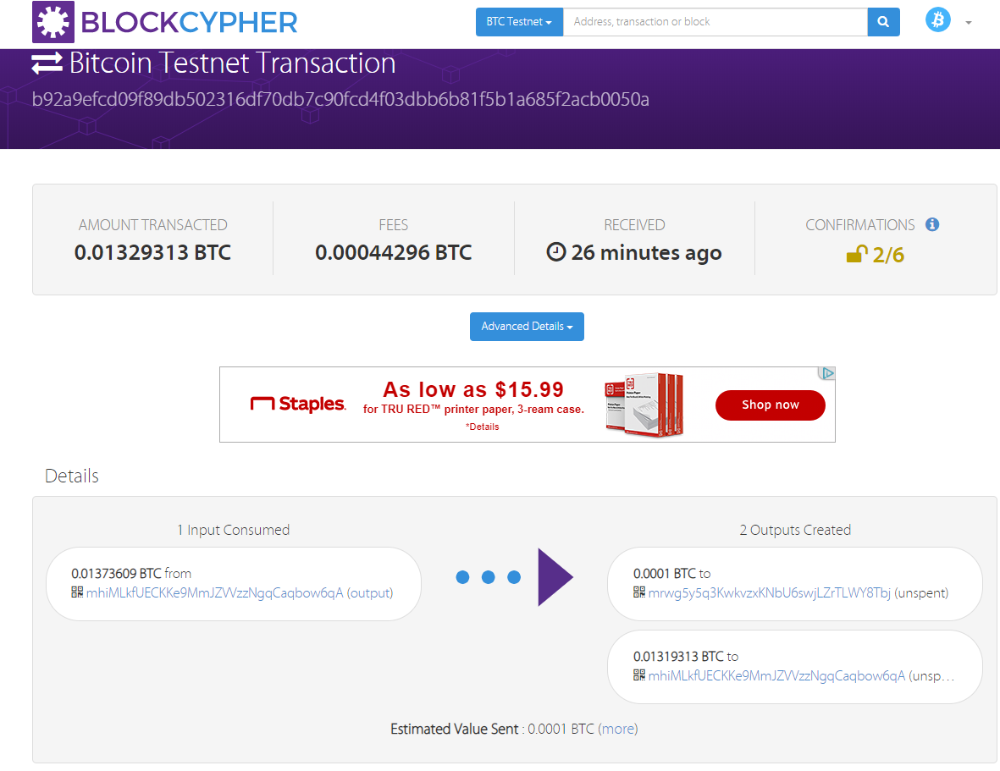
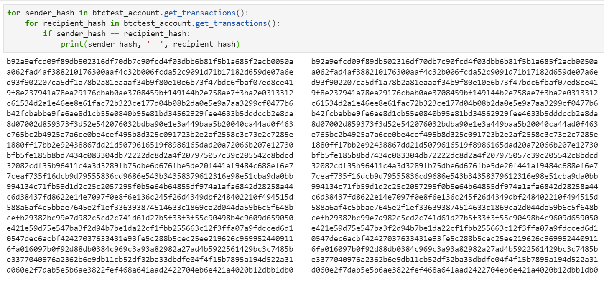
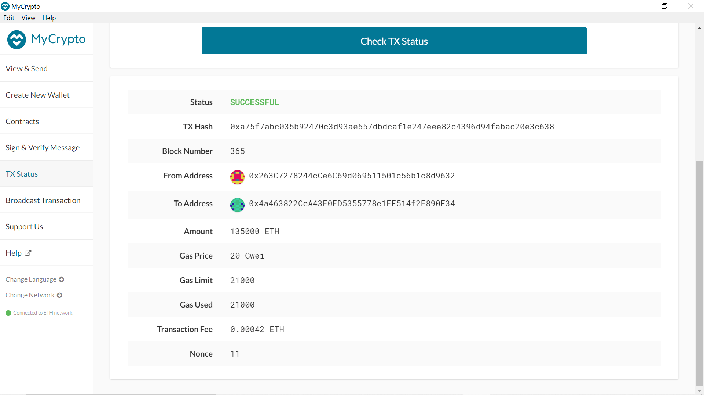

# Multi-Blockchain Wallet in Python
## Overview
---
Develop a Python script to integrate the command line tool, [hd-wallet-derive](https://github.com/dan-da/hd-wallet-derive#installation-and-running), into the backend of a "universal" wallet system to manage crypto-assets. To start the system will offer support for Ethereum and Bitcoin Testnet.

The first step is to generate a mnemonic key if you don't have one already. The simplest method is to use [this tool](https://iancoleman.io/bip39/). This will be used as the master key to derive the tree of addresses and private keys for the crypto-assets. The mnemonic key should not be hard coded into the script for security purposes, therefore it is recommended to save it insise an `.env ` file. Create a `constants.py` file to hold the list of coins supported by the system. This will help to keep the Python script much cleaner as the system expands to support more crypto-assets. 

Create a `wallet.py` file and develop the backend script for the "universal" wallet system. Use this tool to derive child keys from one master key. The final product will be reusable with different mnemonic phrases and have the flexibility to add support for different crypo-currencies. All `pip` dependencies and `hd-wallet-derive` should be installed before testing the Python script. Refer to the [requirements.text](requirements.txt)
### Derive the wallet keys
```python
def derive_wallets(mnemonic, coin, numderive):
    '''This function uses the subprocess library to call the ./derive script from Python.  It returns a tree 
    of wallets(child keys) for specific mnemonic phrase and coin name.'''
    command = f'php derive -g --mnemonic="{mnemonic}" --numderive={numderive} --coin="{coin}" --format=json'
    
    # Creating child process
    process = subprocess.Popen(command, stdout=subprocess.PIPE, shell=True)
    
    # Capture output and error
    (output, error) = process.communicate()
    
    # Wait for child process to terminate before proceeding
    process_status = process.wait()
    
    # Parse output into a JSON object
    output = json.loads(output)
    return output

# Creating list of coin names
coin_names = [ETH, BTCTEST]
coin_names

# Create an object that derives wallets from coin_names
coins = {coin: derive_wallets(os.getenv('MNEMONIC'), coin,3) for coin in coin_names}
```
## Linking the transaction signing libraries
```python 
def key_to_account(coin, priv_key): 
    '''Converts the private key string in a child key to an account object that bit or web3.py can use 
    to do transactions'''
    if coin == ETH: 
        return Account.from_key(priv_key)
    elif coin == BTCTEST:
        return bit.PrivateKeyTestnet(priv_key)

def create_tx(coin, account, recipient, amount):
    ''' This function creates a raw, unsigned transactions that contains all the metadata needed to transact.
    '''
    if coin == ETH:
        gasEstimate= w3.eth.estimateGas({'from':account.address, 'to':recipient,'value':amount})
        return {
            'to': recipient,
            'from': account.address,
            'value': amount,
            'gas': gasEstimate,
            'gasPrice': w3.eth.gasPrice,
            'nonce': w3.eth.getTransactionCount(account.address),
            #'chainID': w3.eth.chainId   
            }
    elif coin == BTCTEST:
        return bit.PrivateKeyTestnet.prepare_transaction(account.address, [(recipient.address, amount, BTC)])

def send_tx(coin, account, recipient, amount):
    '''This function calls the create_tx function, then sends the metadata to the designated network'''
    raw_txn = create_tx(coin, account, recipient, amount)
    if coin == ETH:        
        # Sign the transaction to validate
        signed_tx = account.sign_transaction(raw_txn)
        return w3.eth.sendRawTransaction(signed_tx.rawTransaction)
    elif coin == BTCTEST:
        signed_tx = account.sign_transaction(raw_txn)
        return bit.network.NetworkAPI.broadcast_tx_testnet(signed_tx)
```
## Sending Testnet transaction
Use a new terminal window and cd to your `wallet`. Run the `Python` shell and execute the following command `from wallet import *`. Now all functions from `wallet.py` are 
### Bitcoin Testnet 
1. Using one of derived addresses for BTCTEST, request test bitcoin from [this tesnet faucet](https://coinfaucet.eu/en/btc-testnet/) to fund the wallet.
2. Use the functions to set, create, sign, and send a transaction to another testnet address. 
###### Confirmation of the transaction on [blockcypher](https://www.blockcypher.com/)

This is the code: 
```python 
btctest_priv_key = coins['btc-test'][0]['privkey']
btctest_account = key_to_account(BTCTEST, btctest_priv_key)
btc_recipient_priv_key = coins['btc-test'][1]['privkey']
btc_recipient_account = key_to_account(BTCTEST, btc_recipient_priv_key)
send_tx(BTCTEST, btctest_account, btc_recipient_account.address, .0001)
```
These are the hash IDs for all the transactions between the two testnet wallets

### Local PoA Ethereum transaction
This assumes that a private testnet has been setup to explore blockchains. Refer to this [blockchain](https://github.com/jaimebunay/blockchain) repository for instructions. 
1. Add one of the derived `ETH` addresses, or more, to the pre-allocated accounts in the `networkname.json`
2. Delete the geth folder in each node, then re-initialize using `geth --datadir nodeX init networkname.json`.
This will create a new chain, and will pre-fund the new accounts. 
3. Start the nodes and connet MyCrypto to the custom private network. Using MyCrypto bring the blockchain to life by sending a couple of transactions using one of the derived `ETH` addresses private key, or one of the nodes keystore files. (Note: The addresses must be part of the `networkname.json` file in order for this to work.)
4. Using the opened terminal, send transactions from the pre-funded accounts within the wallet to another. 
5. Copy the transaction id into MyCrypto's TX Status to review the transactions. 
###### Confirmation of transaction on MyCryto 

This is the code: 
```python
eth_acc_priv_key = coins['eth'][0]['privkey'] # sender private key
eth_acc_address = key_to_account(ETH, eth_acc_priv_key) # sender public address
eth_recipient_address = "0x4a463822CeA43E0ED5355778e1EF514f2E890F34" # Recipient public address (is part of jaimenet.json)
print('This is the TX id:',send_tx(ETH, eth_acc_address, eth_recipient_address, 1150000000000000000000))
```


